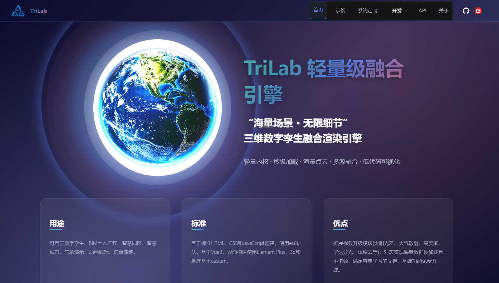
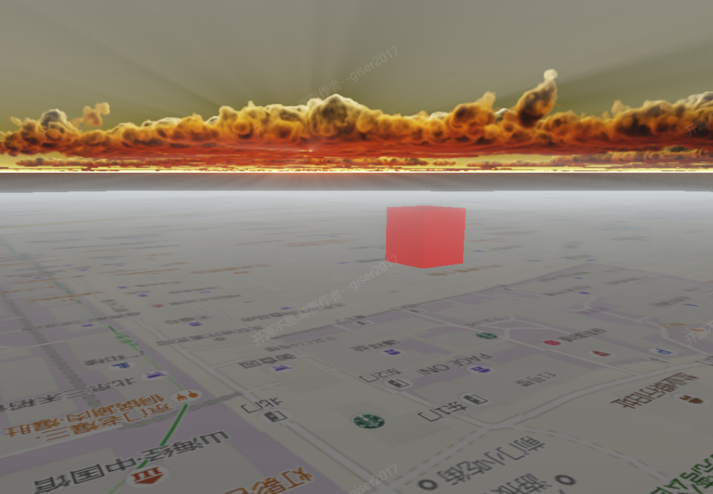
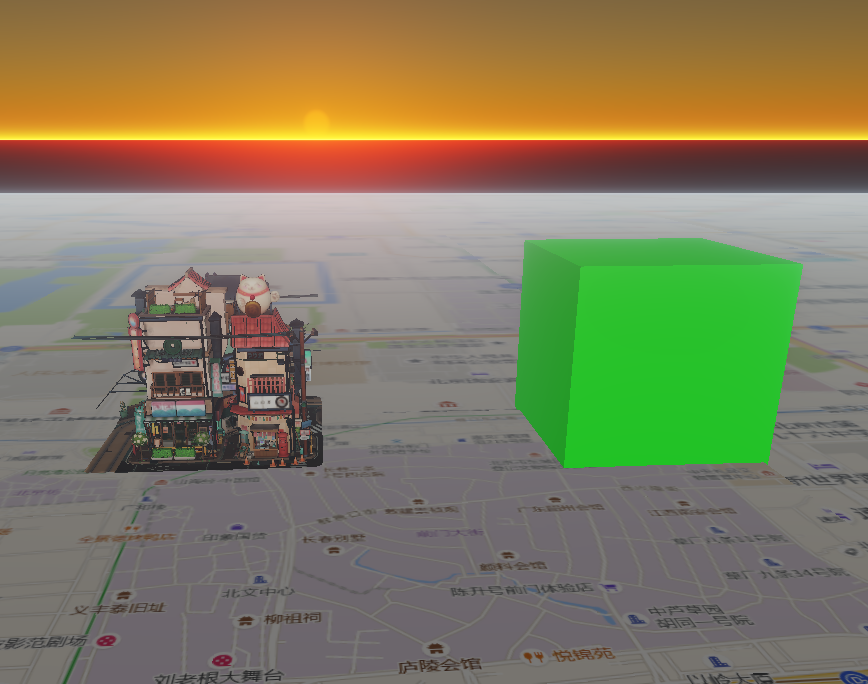

# TriLab引擎：融合Three.js与Cesium的开源三维地图引擎

## 引擎概述

TriLab是一款基于Three.js和Cesium深度融合的开源三维地图引擎，专为现代WebGL开发者打造。该引擎结合了Three.js强大的三维渲染能力和Cesium专业的地理信息系统功能，为开发者提供了一个功能全面、性能卓越的三维可视化解决方案。

### 引擎标识

## 核心技术特色

### 1. 先进的体积光渲染技术
TriLab引擎集成了专业的体积光渲染系统，能够实现真实的光线散射和大气散射效果。通过优化的Shader算法，引擎能够高效渲染：

- **体积光效果**：实现真实的光束散射和光晕效果
- **大气散射**：模拟真实的大气光学现象
- **动态光照**：支持实时动态光源和阴影计算

### 2. 逼真的体积云渲染
引擎内置了先进的体积云渲染系统，支持：

- **动态云层生成**：实时生成逼真的云层效果
- **云层物理模拟**：模拟云层的动态变化和光照交互
- **多层级云系统**：支持不同高度和类型的云层渲染

### 3. 海量点云数据加载
TriLab引擎针对大规模点云数据进行了深度优化：

- **高效数据压缩**：采用先进的点云压缩算法
- **LOD层级管理**：智能的多层级细节管理
- **实时渲染优化**：支持百万级点云的流畅渲染
- **动态加载机制**：按需加载，减少内存占用

### 4. Three.js与Cesium无缝集成
TriLab引擎最大的创新在于将两个强大的引擎完美融合：

- **统一坐标系**：实现WGS84与UTM坐标系的智能转换
- **渲染管线整合**：统一的渲染管线和资源管理
- **API统一封装**：提供一致的开发接口

## 技术亮点展示

### 体积光效果演示

### 太阳光照系统

## 主要功能特性

### 地理信息系统功能
- **坐标转换**：支持WGS84、UTM等多种坐标系的自动转换
- **地形渲染**：集成Cesium专业的地形渲染能力
- **影像图层**：支持多种影像数据源的叠加显示
- **实体管理**：完整的空间实体创建和管理系统

### 三维渲染能力
- **模型加载**：支持glTF、GLB等多种三维模型格式
- **材质系统**：完整的PBR材质渲染支持
- **后期处理**：集成丰富的后期处理效果
- **动画系统**：支持骨骼动画和关键帧动画

### 开发工具支持
- **低代码开发**：提供可视化配置和低代码开发环境
- **调试工具**：内置性能监控和调试工具
- **示例库**：丰富的应用案例和代码示例
- **社区支持**：活跃的开发者社区和技术支持

## 技术架构优势

### 模块化设计
TriLab引擎采用高度模块化的架构设计，各个功能模块可以独立使用或组合部署：

- **核心渲染模块**：负责基础的3D渲染功能
- **GIS功能模块**：提供专业的地理信息处理能力
- **特效模块**：包含体积光、体积云等高级特效
- **工具模块**：开发调试和性能优化工具

### 性能优化
引擎在性能方面进行了深度优化：

- **WebGL 2.0支持**：充分利用现代GPU的计算能力
- **多线程渲染**：支持Web Worker多线程渲染
- **内存管理**：智能的内存分配和垃圾回收机制
- **渲染优化**：基于视锥体裁剪的渲染优化

## 应用场景

### 智慧城市
- **城市规划**：三维城市模型的可视化展示
- **基础设施管理**：地下管网、交通网络的三维管理
- **应急指挥**：灾害应急的三维可视化指挥系统

### 数字孪生
- **工业制造**：工厂设备的数字孪生展示
- **建筑BIM**：建筑信息模型的三维可视化
- **园区管理**：智慧园区的三维管理平台

### 地理信息
- **地质勘探**：地质数据的三维可视化分析
- **环境监测**：环境数据的时空可视化
- **军事应用**：战场环境的三维模拟

## 开发优势

### 易于上手
- **统一API**：简化的API设计，降低学习成本
- **丰富文档**：完善的开发文档和教程
- **示例丰富**：大量可直接运行的代码示例

### 扩展性强
- **插件机制**：支持自定义插件的开发
- **模块化**：可按需加载功能模块
- **开源生态**：基于开源技术栈，生态丰富

### 跨平台支持
- **Web端支持**：基于WebGL，支持所有现代浏览器
- **移动端适配**：响应式设计，支持移动设备
- **桌面应用**：可集成到Electron等桌面应用框架

## 模拟代码实战

为了帮助开发者更好地理解TriLab引擎的技术实现原理，我们提供了模拟代码实战项目：

**模拟代码仓库**：https://github.com/AivoGenX/trilab-mock-code-example

该项目包含：
- **Three.js实战案例分析**：深度剖析Three.js在TriLab中的应用
- **GraphicLayer图形图层系统实现**：完整的GraphicLayer类及其核心功能
- **智慧城市传感器监控实战**：500个动态传感器场景的完整实现
- **技术架构深度解析**：事件系统、样式管理、交互事件等核心技术

## 结语

TriLab引擎作为Three.js与Cesium深度融合的开源解决方案，为三维地图可视化领域带来了全新的可能性。无论是专业的GIS应用开发，还是复杂的三维可视化项目，TriLab都能提供强大的技术支持和优秀的性能表现。

**开源地址**：https://github.com/AivoGenX/TriLabEngine 
**官方网站**：https://threelab.cn  
**社区论坛**：https://forum.threelab.cn

加入TriLab社区，与全球开发者一起探索三维可视化的无限可能！